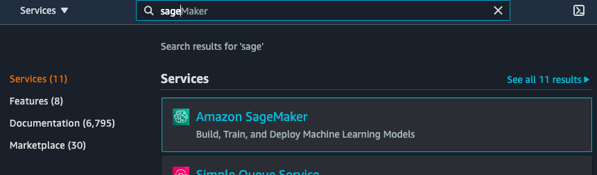
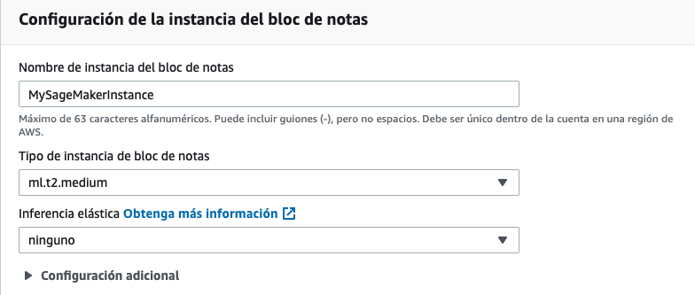

# Iniciando Sagemaker ML

En este tutorial te enseñare un poco de Sagemaker usando un ejemplo sencillo de Machine Learning. 

## ¿Que es Sagemaker?
Aprendizaje automático al alcance de cualquier científico de datos y desarrollador. 

Amazon [SageMaker](https://aws.amazon.com/es/sagemaker/) ayuda a los científicos de datos y a los desarrolladores a preparar, crear, entrenar e implementar con rapidez modelos de aprendizaje automático de alta calidad al poner a disposición un amplio conjunto de capacidades especialmente creadas para el aprendizaje automático.

[Video: Introduction to Amazon SageMaker](https://www.youtube.com/watch?v=Qv_Tr_BCFCQ)


## Casos de Uso
- [Mantenimiento predictivo](https://pages.awscloud.com/Implementing-Machine-Learning-Solutions-with-Amazon-SageMaker_2019_0722-MCL_OD.html?&trk=sl_card&trkCampaign=NA-FY19-AWS-DIGMKT-WEBINAR-SERIES-July_2019_0722-MCL&sc_channel=el&sc_campaign=pac_2018-2019_exlinks_ondemand_OTT_evergreen&sc_outcome=Product_Adoption_Campaigns&sc_geo=NAMER&sc_country=mult&trkcampaign=wbnrondemand)
- [Visión artificial](https://aws.amazon.com/es/blogs/iot/sagemaker-object-detection-greengrass-part-1-of-3/)
- [Conducción autónoma](https://aws.amazon.com/es/blogs/machine-learning/labeling-data-for-3d-object-tracking-and-sensor-fusion-in-amazon-sagemaker-ground-truth/)
- [Detección de fraudes](https://www.youtube.com/watch?v=elRQPCHDBPE&t=4s)
- [Predicción de riesgos crediticios](https://www.youtube.com/watch?v=Nlwz4cU68T8)
- [Extracción y análisis de datos a partir de documentos](https://aws.amazon.com/es/blogs/machine-learning/maximizing-nlp-model-performance-with-automatic-model-tuning-in-amazon-sagemaker/)
- [Predicción de pérdida de clientes](https://aws.amazon.com/es/blogs/machine-learning/making-machine-learning-predictions-in-amazon-quicksight-and-amazon-sagemaker/)
- [Previsión de demanda](https://www.youtube.com/watch?v=A04TT68Bd8A)
- [Recomendaciones personalizadas](https://aws.amazon.com/es/blogs/startups/how-dely-uses-amazon-sagemaker-to-deliver-personalized-recipes/)

Fuente y github con modelos: [Casos de uso](https://aws.amazon.com/es/sagemaker/getting-started/)

___

## Algoritmos integrados de AWS Sagemaker
Fuente: https://docs.aws.amazon.com/es_es/sagemaker/latest/dg/algos.html

AWS Sagemaker proporciona una serie de algoritmos integrados que ayuda a mejorar la preforma del aprendizaje automático. 

| Modelo | Tipos de problemas | Algoritmos |
|:---:|:---:|:---:|
|[Aprendizaje supervisado](https://docs.aws.amazon.com/es_es/sagemaker/latest/dg/algos.html#algorithms-built-in-supervised-learning)| Clasificación binaria/ de varias clases - Regresión - Previción de series temporales |Linear Learner  - Factorization Machines  - XGBoost  - K-Nearest Neighbors (k-NN) |
|[Aprendizaje no supervisado](https://docs.aws.amazon.com/es_es/sagemaker/latest/dg/algos.html#algorithms-built-in-unsupervised-learning)|Ingeniería de características: reducción de la dimensionalidad - Detección de anomalías - Integraciones: convierten objetos de grandes dimensiones en espacio de baja dimensionalidad - Agrupación o agrupación en clústeres - Modelado de temas | PCA - K-Means - IP Insights - Random Cut Forest (RCF)|
|[Análisis de texto](https://docs.aws.amazon.com/es_es/sagemaker/latest/dg/algos.html#algorithms-built-in-text-analysis) |Clasificación de textos - Traducción automática de Algoritmo - Resumir texto - Texto a voz | Blazing Tex - Sequence-to-Sequence - LDA - NTM
|[Gema Image Processing](https://docs.aws.amazon.com/es_es/sagemaker/latest/dg/algos.html#algorithms-built-in-image-processing) |Clasificación de imágenes y etiquetas múltiple - Detección y clasificación de objetos - Visión artificial | Image Classification - Semantic Segmentation - Object Detection |

___

## Tutorial Crear, entrenar e implementar un modelo de Machine Learning con AWS Sagemaker

Fuente: https://aws.amazon.com/es/getting-started/hands-on/build-train-deploy-machine-learning-model-sagemaker/

En este tutorial, aprenderá a utilizar Amazon SageMaker para crear, entrenar e implementar un modelo de aprendizaje automático (ML). Para este ejercicio, utilizaremos el conocido algoritmo de aprendizaje automático [XGBoost](https://docs.aws.amazon.com/sagemaker/latest/dg/xgboost.html) el cual esta integrado en Sagemaker. 

En este tutorial, asumirá el rol de un desarrollador de aprendizaje automático que trabaja en un banco. Se le solicita desarrollar un modelo de aprendizaje automático para predecir si los clientes se inscribirán para un certificado de depósito. El modelo se entrenará con el conjunto de datos de marketing que contiene la información demográfica de los clientes, sus respuestas a los eventos de marketing y los factores externos.

Los datos se etiquetaron para su conveniencia. Una columna en el conjunto de datos identifica si el cliente está inscrito para algún producto que ofrece el banco. Una versión de este conjunto de datos está disponible para el público en el repositorio de aprendizaje automático a cargo de la Universidad de California, Irvine. Este tutorial implementa un modelo de aprendizaje automático supervisado debido a que los datos están etiquetados. (El aprendizaje no supervisado tiene lugar cuando los conjuntos de datos no están etiquetados).

En este tutorial, hará lo siguiente:

1. Creará una instancia de bloc de notas
2. Preparará los datos
3. Entrenará el modelo para aprender de los datos
4. Implementará el modelo
5. Evaluará el rendimiento de su modelo de aprendizaje automático
 
Los recursos creados y utilizados en este tutorial se pueden utilizar en la capa gratuita de AWS. Recuerde completar el Paso 7 y terminar sus recursos. Si su cuenta ha estado activa con estos recursos por más de dos meses, se cobrará menos de 0,50 USD por ella.

## Paso 0: ¿Que es XGBoost?

Es una implementación de código abierto popular y eficiente del algoritmo de árboles aumentados de gradientes. La potenciación de gradientes es un algoritmo de aprendizaje supervisado que intenta predecir de forma apropiada una variable de destino mediante la combinación de un conjunto de estimaciones a partir de un conjunto de modelos más simples y más débiles. Funciona bien en competiciones de aprendizaje automático debido a su manejo robusto de una variedad de tipos de datos, relaciones, distribuciones y la variedad de hiperparámetros que puede ajustar. 

Puede usar **XGBoost** para problemas de **regresión**, de **clasificación (binaria y multiclase)** y de **ranking**.

Fuente: [AWS XGBoost](https://docs.aws.amazon.com/es_es/sagemaker/latest/dg/xgboost.html)

Más sobre XGBoost --> [Boosting - EXPLAINED!](https://www.youtube.com/watch?v=MIPkK5ZAsms)

## Paso 1: Abra la consola de Amazon SageMaker

Diríjase a la consola de Amazon SageMaker.



Abra **SageMaker**

## Paso 2: Cree una instancia de bloc de notas de Amazon SageMaker

En este paso, creará una instancia de bloc de notas de Amazon SageMaker. 
 
### 2.a 

Abra **notebook instances**


y seleccione Create notebook Instance en la parte superior derecha


### 2b. 
En la página **Crear instancia de bloc de notas**, escriba un nombre en el campo **Nombre de la instancia de bloc de notas**. Este tutorial utiliza **MySageMakerInstance** como nombre de la instancia, pero puede elegir un nombre diferente si lo desea.

Para este tutorial, puede mantener el **Tipo de instancia de bloc de notas** predeterminado **ml.t2.medium**.



Para permitir que la instancia de bloc de notas acceda a Amazon S3 y pueda cargar datos de manera segura en este servicio, se debe especificar un rol de IAM. En el campo **Rol de IAM**, elija **Crear un nuevo rol** para que Amazon SageMaker cree un rol con los permisos necesarios y lo asigne a su instancia. De forma alternativa, puede elegir un rol de IAM existente en su cuenta para este fin.


### 2c. 

En el cuadro **Crear un rol de IAM**, seleccione **Cualquier bucket de S3**. Esto permite que su instancia de Amazon SageMaker acceda a todos los buckets de S3 de su cuenta. Más adelante en este tutorial, creará un nuevo bucket de S3. Sin embargo, si ya cuenta con un bucket que desea utilizar, seleccione **Buckets de S3 específicos** e indique el nombre del bucket.

Elija **Crear rol**.


### 2d. 

Tenga en cuenta que Amazon SageMaker creó para usted un rol denominado **AmazonSageMaker-ExecutionRole-*****.


Para este tutorial, utilizaremos los valores predeterminados en los demás campos. Elija **Crear instancia de bloc de 
notas**.

### 2e. 
En la página **Instancias de bloc de notas**, debería ver su nueva instancia de bloc de notas **MySageMakerInstance** con el estado **Pendiente**.


Su instancia de bloc de notas debería pasar del estado **Pendiente** al estado **En servicio** en menos de dos minutos.

### 2f
Para este paso debes detener la instancia en **Acciones** --> **Detener** 


Evita que la instancia de SageMaker se quede activa cuando no la estés usando y así no incurrir en gastos innecesarios, para eso debes agregar la **Configuración del ciclo de vida**.

Esto lo puedes realizar al momento de crear la maquina o luego de crearla editando la configuración. 

Entra a la configuración de la instancia dando click sobre su nombre: 


Presiona editar, arriba a la derecha, en **Configuración adicional** selecciona **Crear una nueva configuración de ciclo de vida**, en la ventana emergente nombralo como prefieras y abre la lista de scripts para iniciar: 


El link te llevara al GitHub [amazon-sagemaker-notebook-instance-lifecycle-config-samples](https://github.com/aws-samples/amazon-sagemaker-notebook-instance-lifecycle-config-sample) , entra a la carpeta scripts --> auto-stop-idle y copia el codigo en [on-start.sh](https://github.com/aws-samples/amazon-sagemaker-notebook-instance-lifecycle-config-samples/blob/master/scripts/auto-stop-idle/on-start.sh) 

Pega el codigo en la ventana emergente y avanza con **Crear una configuración**


### 2e
Agrega un repocitorio Git a tu instancia. 

En la misma edición del paso anterior, ve al fondo donde dice **Repositorios Git - opcional**, selecciona **Clone un repositorio Git público en esta instancia de bloc de notas solamente** y copia el preositorio creado para este ejemplo [Iniciando_SagemakerML](https://github.com/elizabethfuentes12/Iniciando_SagemakerML)


Finaliza con **Actualizar instancia del bloc de notas**

## Paso 3: Prepare los datos

En este paso, utilizará su bloc de notas de Amazon SageMaker a fin de procesar previamente los datos que necesita para entrenar su modelo de aprendizaje automático.

### 3a. 

En la página **Instancias de bloc de notas**, aguarde hasta que la instancia **MySageMakerInstance** haya pasado del estado **Pendiente** al estado **En servicio**.

Después de que el estado cambie a **En servicio**, seleccione la instancia **MySageMakerInstance** y ábrala a través del menú desplegable **Acciones** o elija la opción **Abrir JupyterLab**, que aparece junto al estado **En servicio**.

### 3b. 

Después de que Jupyter se abra, en la pestaña **Archivos**, elija **Nuevo**, **Notebook** y, luego, **conda_python3**. 

### 3c. 

Para preparar los datos, entrenar el modelo de aprendizaje automático e implementarlo, deberá importar algunas bibliotecas y definir algunas variables del entorno en su entorno de bloc de notas de Jupyter. Copie el siguiente código o ejecutelo directamente de la carpeta **codigo** en el [GitHub](https://github.com/elizabethfuentes12/Iniciando_SagemakerML) creado para este tutorial en la celda de código de su instancia y seleccione **Ejecutar** o las teclas **Shift+Enter**.

```python 
# import libraries
import boto3, re, sys, math, json, os, sagemaker, urllib.request
from sagemaker import get_execution_role
import numpy as np                                
import pandas as pd                               
import matplotlib.pyplot as plt                   
from IPython.display import Image                 
from IPython.display import display               
from time import gmtime, strftime                 
from sagemaker.predictor import csv_serializer   

# Define IAM role
role = get_execution_role()
prefix = 'sagemaker/DEMO-xgboost-dm'
containers = {'us-west-2': '433757028032.dkr.ecr.us-west-2.amazonaws.com/xgboost:latest',
              'us-east-1': '811284229777.dkr.ecr.us-east-1.amazonaws.com/xgboost:latest',
              'us-east-2': '825641698319.dkr.ecr.us-east-2.amazonaws.com/xgboost:latest',
              'eu-west-1': '685385470294.dkr.ecr.eu-west-1.amazonaws.com/xgboost:latest'} # each region has its XGBoost container
my_region = boto3.session.Session().region_name # set the region of the instance
print("Success - the MySageMakerInstance is in the " + my_region + " region. You will use the " + containers[my_region] + " container for your SageMaker endpoint.")
```

Al finalizar debe verse como la imagen a continación:


### 3d. 

En este paso, creará un bucket de S3 que almacenará sus datos para este tutorial.

Copie el siguiente código en la próxima celda de código de su bloc de notas y cambie el nombre del bucket de S3 para que sea único. Los nombres de los buckets de S3 deben ser únicos a nivel mundial y, además, deben contar con algunas restricciones y limitaciones.

Seleccione **Ejecutar**. Si no recibe un mensaje de finalización exitosa, cambie el nombre del bucket y vuelva a intentarlo.

```python 
bucket_name = 'your-s3-bucket-name' # <--- CHANGE THIS VARIABLE TO A UNIQUE NAME FOR YOUR BUCKET
s3 = boto3.resource('s3')
try:
    if  my_region == 'us-east-1':
      s3.create_bucket(Bucket=bucket_name)
    else: 
      s3.create_bucket(Bucket=bucket_name, CreateBucketConfiguration={ 'LocationConstraint': my_region })
    print('S3 bucket created successfully')
except Exception as e:
    print('S3 error: ',e)

```

### 3e. 

A continuación, debe descargar los datos en su instancia de Amazon SageMaker y cargarlos en un marco de datos. Copie y **Ejecute** el siguiente código:

```python 
try:
  urllib.request.urlretrieve ("https://d1.awsstatic.com/tmt/build-train-deploy-machine-learning-model-sagemaker/bank_clean.27f01fbbdf43271788427f3682996ae29ceca05d.csv", "bank_clean.csv")
  print('Success: downloaded bank_clean.csv.')
except Exception as e:
  print('Data load error: ',e)

try:
  model_data = pd.read_csv('./bank_clean.csv',index_col=0)
  print('Success: Data loaded into dataframe.')
except Exception as e:
    print('Data load error: ',e)

```
Si la descarga es exitosa debe ver el siguiente mensaje: 


Y el siguiente archivo aparecera en su instancia:


### 3f. 

Ahora, mezclaremos los datos y los dividiremos en datos de entrenamiento y de prueba.

Los **datos de entrenamiento** (el 70 % de los clientes) se utilizarán durante el ciclo de entrenamiento del modelo. Utilizaremos la optimización basada en gradientes para refinar de forma iterativa los parámetros del modelo. La optimización basada en gradientes es una forma de encontrar valores de parámetros del modelo que minimicen sus errores, mediante el uso de gradientes de la función de pérdida del modelo.

Los **datos de prueba** (el 30 % restante de los clientes) se utilizarán para evaluar el rendimiento del modelo y para medir el nivel de generalización de los datos nuevos del modelo entrenado.

Copie el siguiente código en una nueva celda de código y seleccione **Ejecutar** para mezclar y dividir los datos:

```python
train_data, test_data = np.split(model_data.sample(frac=1, random_state=1729), [int(0.7 * len(model_data))])
print(train_data.shape, test_data.shape)
```

## Paso 4: Entrene el modelo con los datos

En este paso, entrenará su modelo de aprendizaje automático con el conjunto de datos de entrenamiento. 

### 4a. 
Para utilizar un modelo XGBoost prediseñado de Amazon SageMaker, deberá cambiar el formato del encabezado y la primera columna de los datos de entrenamiento y cargar los datos desde el bucket de S3.

Copie el siguiente código en una nueva celda de código y seleccione **Ejecutar** para cambiar el formato y cargar los datos:

```python
pd.concat([train_data['y_yes'], train_data.drop(['y_no', 'y_yes'], axis=1)], axis=1).to_csv('train.csv', index=False, header=False)
boto3.Session().resource('s3').Bucket(bucket_name).Object(os.path.join(prefix, 'train/train.csv')).upload_file('train.csv')
s3_input_train = sagemaker.s3_input(s3_data='s3://{}/{}/train'.format(bucket_name, prefix), content_type='csv')

```
### 4b. 

A continuación, deberá configurar la sesión de Amazon SageMaker, crear una instancia del modelo XGBoost (un estimador) y definir los hiperparámetros del modelo. Copie el siguiente código en una nueva celda de código y seleccione **Ejecutar**:

```python
sess = sagemaker.Session()
xgb = sagemaker.estimator.Estimator(containers[my_region],role, train_instance_count=1, train_instance_type='ml.m4.xlarge',output_path='s3://{}/{}/output'.format(bucket_name, prefix),sagemaker_session=sess)
xgb.set_hyperparameters(max_depth=5,eta=0.2,gamma=4,min_child_weight=6,subsample=0.8,silent=0,objective='binary:logistic',num_round=100)
```
### 4c. 
Con los datos cargados y el estimador XGBoost configurado, entrene el modelo a través de la optimización basada en gradientes en una instancia **ml.m4.xlarge**; copie el siguiente código en la próxima celda de código y seleccione **Ejecutar**.

Luego de algunos minutos, debería comenzar a ver los registros de entrenamiento que se generen.

```python
xgb.fit({'train': s3_input_train})
```
## Paso 5: Implemente el modelo

En este paso, implementará el modelo entrenado en un punto de enlace, cambiará el formato y cargará los datos CSV. Luego, ejecutará el modelo para crear predicciones.

### 5a. 
Para implementar el modelo en un servidor y crear un punto de enlace al que pueda acceder, copie el siguiente código en la próxima celda de código y seleccione **Ejecutar**:

```python
xgb_predictor = xgb.deploy(initial_instance_count=1,instance_type='ml.m4.xlarge')
```
### 5b. 
Para predecir si los clientes de los datos de prueba se inscribieron o no en el producto del banco, copie el siguiente código en la próxima celda de código y seleccione **Ejecutar**:

```python
test_data_array = test_data.drop(['y_no', 'y_yes'], axis=1).values #load the data into an array
xgb_predictor.content_type = 'text/csv' # set the data type for an inference
xgb_predictor.serializer = csv_serializer # set the serializer type
predictions = xgb_predictor.predict(test_data_array).decode('utf-8') # predict!
predictions_array = np.fromstring(predictions[1:], sep=',') # and turn the prediction into an array
print(predictions_array.shape)

```
## Paso 6. Evalúe el rendimiento del modelo
En este paso, evaluará el rendimiento y la precisión del modelo de aprendizaje automático.

### 6a. 

Copie y pegue el siguiente código y seleccione **Ejecutar** para comparar los valores reales con los valores predichos en una tabla denominada **matriz de confusión**.

En función de las predicciones, podemos concluir que usted predijo que un cliente se inscribiría para un certificado de depósito exactamente para el 90 % de los clientes en los datos de prueba, con una precisión del 65 % (278/429) para los inscritos y del 90 % (10 785/11 928) para los no inscritos.

```python
cm = pd.crosstab(index=test_data['y_yes'], columns=np.round(predictions_array), rownames=['Observed'], colnames=['Predicted'])
tn = cm.iloc[0,0]; fn = cm.iloc[1,0]; tp = cm.iloc[1,1]; fp = cm.iloc[0,1]; p = (tp+tn)/(tp+tn+fp+fn)*100
print("\n{0:<20}{1:<4.1f}%\n".format("Overall Classification Rate: ", p))
print("{0:<15}{1:<15}{2:>8}".format("Predicted", "No Purchase", "Purchase"))
print("Observed")
print("{0:<15}{1:<2.0f}% ({2:<}){3:>6.0f}% ({4:<})".format("No Purchase", tn/(tn+fn)*100,tn, fp/(tp+fp)*100, fp))
print("{0:<16}{1:<1.0f}% ({2:<}){3:>7.0f}% ({4:<}) \n".format("Purchase", fn/(tn+fn)*

```

## Paso 7: Termine los recursos
En este paso, terminará los recursos relacionados con Amazon SageMaker.

**Importante:** Terminar los recursos que no se utilizan de forma activa reduce los costos, y es una práctica recomendada. No terminar sus recursos generará cargos.

### 7a. 
Para eliminar el punto de enlace de Amazon SageMaker y los objetos de su bucket de S3, copie, pegue y **Ejecute** el siguiente código:  

```python
sagemaker.Session().delete_endpoint(xgb_predictor.endpoint)
bucket_to_delete = boto3.resource('s3').Bucket(bucket_name)
bucket_to_delete.objects.all().delete()

```
___

## ¡Felicitaciones!

Ha aprendido a utilizar Amazon SageMaker para preparar, entrenar, implementar y evaluar un modelo aprendizaje automático. Amazon SageMaker facilita la creación de modelos de aprendizaje automático y le proporciona todo lo necesario para conectarse rápidamente con los datos de entrenamiento y para seleccionar el mejor algoritmo y marco de trabajo para su aplicación, mientras administra la infraestructura subyacente completa, de manera que pueda entrenar modelos a escala de petabytes.
___

## Ejemplos AWS Sagemaker
Para que continues aprendiendo te dejo un link con varios ejemplos para practicar:

https://github.com/aws/amazon-sagemaker-examples