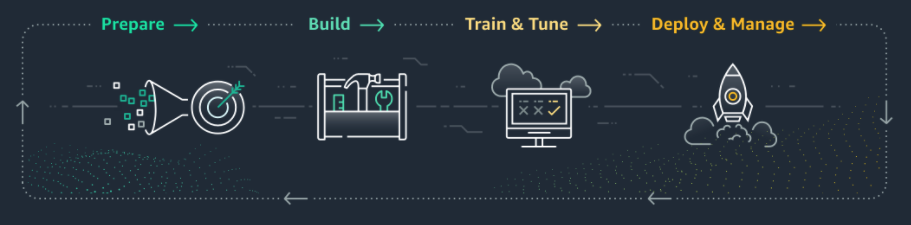

# Iniciando Sagemaker ML

En este tutorial te enseñare un poco de Sagemaker usando un ejemplo sencillo de Machine Learning. 

## ¿Que es Sagemaker?
Aprendizaje automático al alcance de cualquier científico de datos y desarrollador. 

Amazon [SageMaker](https://aws.amazon.com/es/sagemaker/) ayuda a los científicos de datos y a los desarrolladores a preparar, crear, entrenar e implementar con rapidez modelos de aprendizaje automático de alta calidad al poner a disposición un amplio conjunto de capacidades especialmente creadas para el aprendizaje automático.

[Video: Introduction to Amazon SageMaker](https://www.youtube.com/watch?v=Qv_Tr_BCFCQ)

## Casos de Uso
- [Mantenimiento predictivo](https://pages.awscloud.com/Implementing-Machine-Learning-Solutions-with-Amazon-SageMaker_2019_0722-MCL_OD.html?&trk=sl_card&trkCampaign=NA-FY19-AWS-DIGMKT-WEBINAR-SERIES-July_2019_0722-MCL&sc_channel=el&sc_campaign=pac_2018-2019_exlinks_ondemand_OTT_evergreen&sc_outcome=Product_Adoption_Campaigns&sc_geo=NAMER&sc_country=mult&trkcampaign=wbnrondemand)
- [Visión artificial](https://aws.amazon.com/es/blogs/iot/sagemaker-object-detection-greengrass-part-1-of-3/)
- [Conducción autónoma](https://aws.amazon.com/es/blogs/machine-learning/labeling-data-for-3d-object-tracking-and-sensor-fusion-in-amazon-sagemaker-ground-truth/)
- [Detección de fraudes](https://www.youtube.com/watch?v=elRQPCHDBPE&t=4s)
- [Predicción de riesgos crediticios](https://www.youtube.com/watch?v=Nlwz4cU68T8)
- [Extracción y análisis de datos a partir de documentos](https://aws.amazon.com/es/blogs/machine-learning/maximizing-nlp-model-performance-with-automatic-model-tuning-in-amazon-sagemaker/)
- [Predicción de pérdida de clientes](https://aws.amazon.com/es/blogs/machine-learning/making-machine-learning-predictions-in-amazon-quicksight-and-amazon-sagemaker/)
- [Previsión de demanda](https://www.youtube.com/watch?v=A04TT68Bd8A)
- [Recomendaciones personalizadas](https://aws.amazon.com/es/blogs/startups/how-dely-uses-amazon-sagemaker-to-deliver-personalized-recipes/)

Fuente y github con modelos: [Casos de uso](https://aws.amazon.com/es/sagemaker/getting-started/)

## Ejemplos AWS Sagemaker

https://github.com/aws/amazon-sagemaker-examples